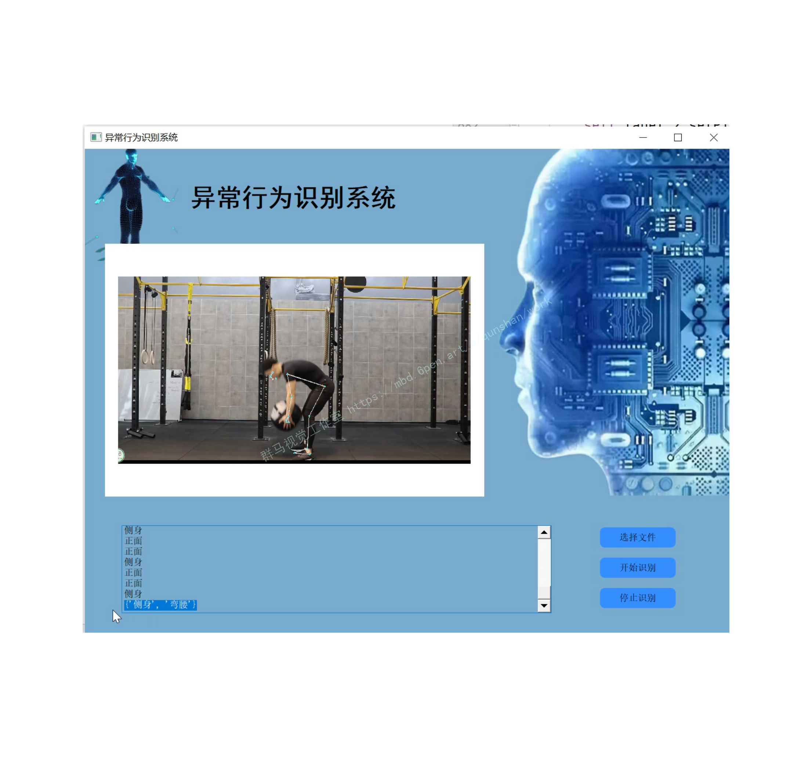
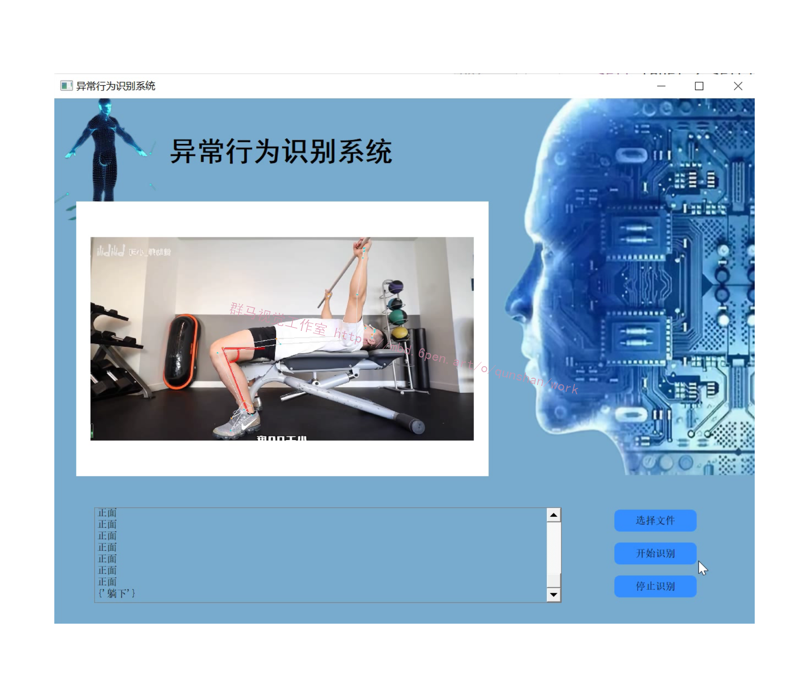
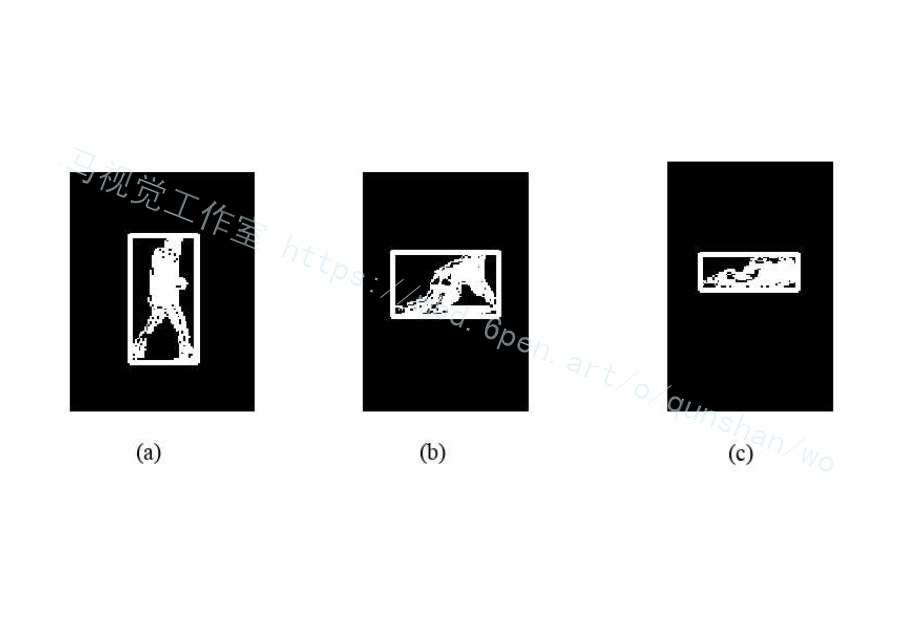
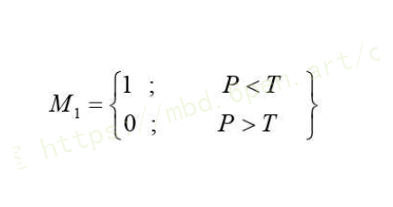
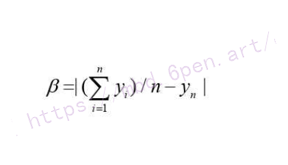
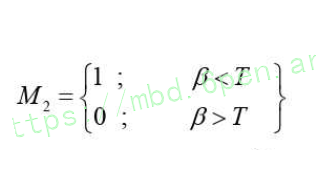
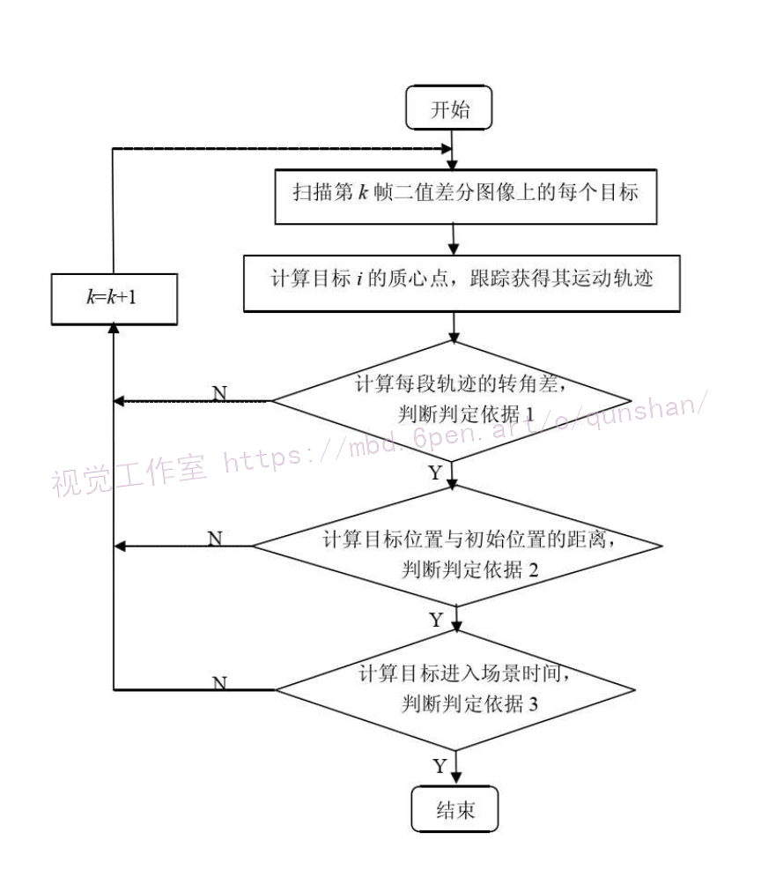

# 1.项目背景
智能视频监控（Intelligent Video Surveillance , IVS）[1.2·3.4是计算机视觉技术5l在安防领域的应用，实现了由“被动监控”到“主动监控”的转变。计算机视觉技术是人工智能系统的一个分支方向，利用摄像机和计算机代替人眼，实现视觉图像信息处理，从而达到识别和理解视频图像内容的目的。智能视频监控借助借助于计算机强大的数据处理功能,依靠计算机视觉等技术，对图像或者监控视频中的内容提取关键信息并快速分析，根据分析的结果对视频监控系统进行反馈处理，从而达到智能识别、理解和处理的效果。总之，智能视频监控以数字化、网络化、智能化为发展方向，实现及时报警，能够大大减轻监控中人工劳动强度，同时可以降低漏报率和误报率，从而使视频监控系统具有较高层次的智能化水平。


# 2.图片演示





# 3.视频演示
[Python基于OpenCV的异常行为检测系统[源码＆部署教程]](https://www.bilibili.com/video/BV1RG4y1B7xg/?vd_source=bc9aec86d164b67a7004b996143742dc)

# 4.人体行为检测
在医院、公园、广场等儿童和老年人经常出现的监控场景中，人体跌倒检测具有重要的应用价值，可有效的保障监护人群的人身安全，并能够及时处理一些突发状况。本文的行人跌倒检测主要是针对监控人群由于突发情况跌倒后长时间无法站立的情况进行检测并报警处理，倘若行人跌倒后在较短的时间内自行站立，则将不进行报警处理。下图给出了人体正常行走和跌倒时的目标轮廓。

由可以看出，当监控人体发生跌倒时，最直观的特征是人体的轮廓发生改变并且重心下降。根据前面讲述的常用几何特征的方法，如果只是简单的比较运动目标的长和高，则会因为运动目标远离或靠近摄像头时长和高都会改变,而它们的比值则不会存在这种情况，[参考该博客方法通过运动人体目标质心变化率和目标外界矩形框长高比的变化进行跌倒行为检测](https://mbd.pub/o/bread/Y5WcmJly)。具体判断标准如下:
1）运动人体外接矩形长高比P = Height / Width 。当人体跌倒时，提取目标的外接矩形也随之发生改变，最显著的表现是长高比的变化。

其中，T是阈值，根据实际情况，一般人体正常行走时，长高比P小于1，而跌倒时长高比大于1，所以T一般取值为1。
(2)运动目标质心变化。当人体跌倒时，重心会下移，在图像中以质心形式体现。由于孤立的对待某一个点值不能全面体现人体运动状态，本文采用质心差值分布β值表示运动状态。

其中，y,表示运动人体第n个质心纵坐标，(>y)/n表示前n个质心纵坐标的平均值，质心的具体计算过程见式(3-2)。当人体正常行走时，质心差值分布β值会处于较小的范围当跌倒时，由于瞬间质心发生突变，β值将会变大。

如果运动人体满足M和M,均为1的条件，即目标外接矩形框的长高比和质心差值分布β值均小于阈值，则认为发生了跌倒行为。此时，记录产生变化时时的时间t，倘若在At时间内，矩形框的长高比和质心差值分布β值始终小于阈值时，则认为人体无法站立，系统将在t+△t时刻进行报警提示处理。检测算法主要步骤:
⑴利用背景减法提取前景目标，并对其进行二值化和形态学处理。
(2)提取并记录前景目标的运动信息，包括目标长高比和质心坐标。
(3)判断前景目标的长高比是否满足M为1，如果满足，则可继续进行步骤(4)判断，否则，返回步骤(1)。
(4)对前景目标计算质心差值分布β值，如果满足条件M,为1，则判断人体跌倒，否则返回步骤(1)。
(5)记录人体跌倒时间，如果长时间满足条件M为 1，则进行报警提示;如果在较短的时间内人体自行站立，则不进行处理。

# 5.人体徘徊检测
在实际监控场景中，通常人体徘徊行为属于异常行为，因为现在的监控场合对安全需求较高，例如国家机关、学校、银行和停车场等场合，需要能够对破坏、偷窃等违法行为进行预警处理，而这些违法行为通常与前期徘徊行为有关，因为徘徊行为体现了一个人彷徨犹豫不决、焦灼心理。所以，人体徘徊检测是智能视频监控系统中的关注热点。
[参考该博客的方法](https://afdian.net/item?plan_id=f735635c630c11eda36652540025c377)，人体徘徊的特点可总结为以下几条:
(1)人体运动轨迹在垂直和水平方向上发生多次方向改变。
(2)当前运动人体位置与进入场景时的起始位置的距离不会一直增大或减小，始终存在由
大变小和由小变大的循环变化过程。
(3)运动人体处于场景的时间较长。

# 6.算法流程图



# 7.代码实现
```
# 执行以下命令：
# python activity_recognition_demo.py --model resnet-34_kinetics.onnx --classes action_recognition_kinetics.txt --input videos/activities.mp4
 
 
from collections import deque
import numpy as np
import argparse
import imutils
import cv2
 
# 构造参数
ap = argparse.ArgumentParser()
ap.add_argument(
    "-m",
    "--model",
    required=True,
    help="path to trained human activity recognition model")
ap.add_argument(
    "-c", "--classes", required=True, help="path to class labels file")
ap.add_argument(
    "-i", "--input", type=str, default="", help="optional path to video file")
args = vars(ap.parse_args())
 
# 类别，样本持续时间（帧数），样本大小（空间尺寸）
CLASSES = open(args["classes"]).read().strip().split("\n")
SAMPLE_DURATION = 16
SAMPLE_SIZE = 112
print("处理中...")
# 创建帧队列
frames = deque(maxlen=SAMPLE_DURATION)
 
# 读取模型
net = cv2.dnn.readNet(args["model"])
# 待检测视频
vs = cv2.VideoCapture(args["input"] if args["input"] else 0)
 
writer = None
# 循环处理视频流
while True:
    # 读取每帧
    (grabbed, frame) = vs.read()
    # 判断视频是否结束
    if not grabbed:
        print("无视频读取...")
        break
    # 调整大小，放入队列中
    frame = imutils.resize(frame, width=640)
    frames.append(frame)
    # 判断是否填充到最大帧数
    if len(frames) < SAMPLE_DURATION:
        continue
    # 队列填充满后继续处理
    blob = cv2.dnn.blobFromImages(
        frames,
        1.0, (SAMPLE_SIZE, SAMPLE_SIZE), (114.7748, 107.7354, 99.4750),
        swapRB=True,
        crop=True)
    blob = np.transpose(blob, (1, 0, 2, 3))
    blob = np.expand_dims(blob, axis=0)
    # 识别预测
    net.setInput(blob)
    outputs = net.forward()
    label = CLASSES[np.argmax(outputs)]
    # 绘制框
    cv2.rectangle(frame, (0, 0), (300, 40), (255, 0, 0), -1)
    cv2.putText(frame, label, (10, 25), cv2.FONT_HERSHEY_SIMPLEX, 0.8,
                (0, 0, 255), 2)
 
    # cv2.imshow("Activity Recognition", frame)
 
    # 检测是否保存
    if writer is None:
        # 初始化视频写入器
        # fourcc = cv2.VideoWriter_fourcc(*"MJPG")
        fourcc = cv2.VideoWriter_fourcc(*"mp4v")
        writer = cv2.VideoWriter(
            "videos\\test.mp4",
            fourcc, 30, (frame.shape[1], frame.shape[0]), True)
 
    writer.write(frame)
 
    # 按 q 键退出
# key = cv2.waitKey(1) & 0xFF
# if key == ord("q"):
#     break
print("结束...")
writer.release()
vs.release()
```
# 8.系统整合
下图[完整源码&环境部署视频教程&自定义UI界面](https://s.xiaocichang.com/s/c74702)

参考博客[《Python基于OpenCV的异常行为检测系统\[源码＆部署教程\]》](https://mbd.pub/o/qunma/work)


# 9.参考文献
*   *[1]*[基于OpenCV的运动目标光流算法仿真](https://kns.cnki.net/kcms/detail/detail.aspx?filename=YYGX200806010&dbcode=CJFD&dbname=CJFD2008&v=ULl_l5RDAgn4s1n6OrmYeqHckoSwCoHMkN-XTwMz4hj9_S0uF0ry4rvvxNquLd6p)[J]. 聂伟乐,瞿建荣.  应用光学. 2008(06)
*   *[2]*[基于改进的混合高斯模型的运动目标检测方法](https://kns.cnki.net/kcms/detail/detail.aspx?filename=XDZK200804012&dbcode=CJFD&dbname=CJFD2008&v=psM5UKB8WxsqQWlg9IcyfIe2TQNfXjHI3mkJHtdabRQ0oJENCgJbFBmPrYos-QZC)[J]. 姚会,苏松志,王丽,李绍滋.  厦门大学学报(自然科学版). 2008(04)
*   *[3]*[基于背景减法和时空熵的运动目标检测新方法](https://kns.cnki.net/kcms/detail/detail.aspx?filename=JSJZ200803066&dbcode=CJFD&dbname=CJFD2008&v=Yf_2wiwfgoC4QjqVv-fBlstKdzYIB5QWcwPwAWksfSq_6Wz_6BrZ9tUpOCekn35v)[J]. 常晓锋,冯晓毅.  计算机仿真. 2008(03)
*   *[4]*[滞留与偷窃物体实时检测与分类算法](https://kns.cnki.net/kcms/detail/detail.aspx?filename=JSJY200710075&dbcode=CJFD&dbname=CJFD2007&v=TbVZvTVaadlzpt9L0dwhaH1G1IA6nuLRnA4ND0jUjsoMq7jTuMkJSkrnCbimKAWF)[J]. 王伟嘉,刘辉,沙莉,刘鑫,姜华.  计算机应用. 2007(10)
*   *[5]*[智能视觉监控技术研究进展](https://kns.cnki.net/kcms/detail/detail.aspx?filename=ZGTB200709003&dbcode=CJFD&dbname=CJFD2007&v=--bYGiluGc_47qBeruEhBh_KE7F_ph0PXDB5S6-z9EYxhbubz0jm-BTrHNVIx3f5)[J]. 王素玉,沈兰荪.  中国图象图形学报. 2007(09)
*   *[6]*[基于视频的入侵检测系统](https://kns.cnki.net/kcms/detail/detail.aspx?filename=DZCL200601063&dbcode=cjfd&dbname=cjfd2006&v=nshKmp4yuVYlOYYr0-C782hwOe15PZGdxC8iXw9e9rv1LFvjRrG58-q_vDQphAxS)[J]. 吴金勇,虞致国,马国强,徐健健.  电子测量技术. 2006(01)
*   *[7]*[开放源代码的计算机视觉类库OpenCv的应用](https://kns.cnki.net/kcms/detail/detail.aspx?filename=JYRJ200508050&dbcode=CJFD&dbname=CJFD2005&v=Y4LOaPk_QdCxkyc3shZpK05cnHgxes__1jyimTR-knHM_1l2zD9O7e51wcdDhwlZ)[J]. 黎松,平西建,丁益洪.  计算机应用与软件. 2005(08)
*   *[8]*[基于直方图的Snake视频对象跟踪算法](https://kns.cnki.net/kcms/detail/detail.aspx?filename=ZGTB20050200A&dbcode=CJFD&dbname=CJFD2005&v=0XdfXFDRUHReNbcwJSXh3NQMMMsRL_EiBn1fx1etmB5A3nNO9Vwp7FqvzV3DtfLI)[J]. 郭礼华,袁晓彤,李建华.  中国图象图形学报. 2005(02)
*   *[9]*[视频监视中运动目标检测与识别方法](https://kns.cnki.net/kcms/detail/detail.aspx?filename=JSJC200416058&dbcode=CJFD&dbname=CJFD2004&v=se1HwT6OsVrOXjJdMkHnVEknw88mh8EjefXxBg3XSHj2k0Pc9qcRCGPjfqPO98m9)[J]. 李庆忠,陈显华,王立红.  计算机工程. 2004(16)
*   *[10]*[IPL和OpenCV在VC++环境下的应用](https://kns.cnki.net/kcms/detail/detail.aspx?filename=WXDY200301010&dbcode=CJFD&dbname=CJFD2003&v=pg7J1GLdV_C5W48lQ3u516hjMGhMbu1a2PvBNovpUK5Y7VgsoLXoZIM-0gRbHZTB)[J]. 吕学刚,于明,刘翠响.  微型电脑应用. 2003(01)


---
#### 如果您需要更详细的【源码和环境部署教程】，除了通过【系统整合】小节的链接获取之外，还可以通过邮箱以下途径获取:
#### 1.请先在GitHub上为该项目点赞（Star），编辑一封邮件，附上点赞的截图、项目的中文描述概述（About）以及您的用途需求，发送到我们的邮箱
#### sharecode@yeah.net
#### 2.我们收到邮件后会定期根据邮件的接收顺序将【完整源码和环境部署教程】发送到您的邮箱。
#### 【免责声明】本文来源于用户投稿，如果侵犯任何第三方的合法权益，可通过邮箱联系删除。